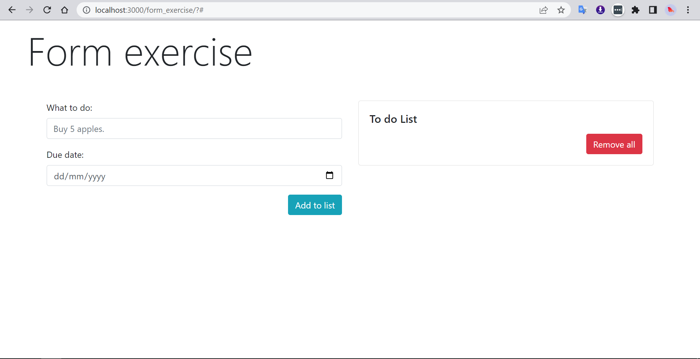

<!-- ABOUT THE PROJECT -->
## About The Form Exercise

In this exercise, a todo list is implemented with a simple form consisting of 2 input fields: Task and the Deadline for the task. Removal of the objects cannot be done...
