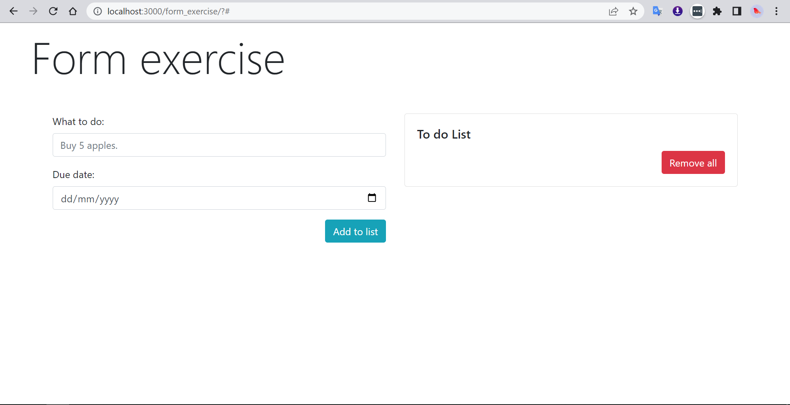
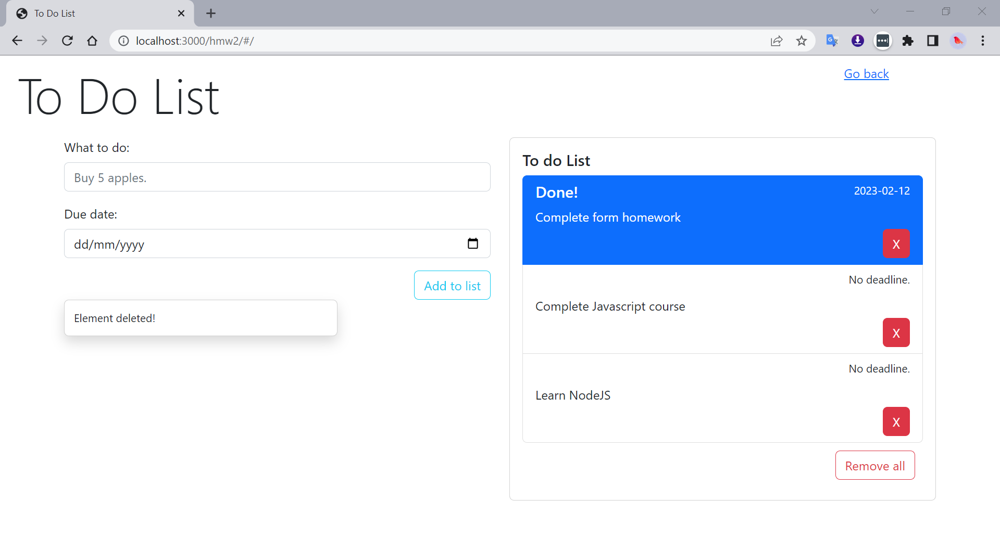

<!-- ABOUT THE PROJECT -->
## About The To Do List

In this homework, a todo list is implemented with a simple form consisting of 2 input fields: Task and the Deadline for the task. Insertion, removal and toasts (bootstrap) are used. Styling is done via Bootstrap.

## Before

## After
