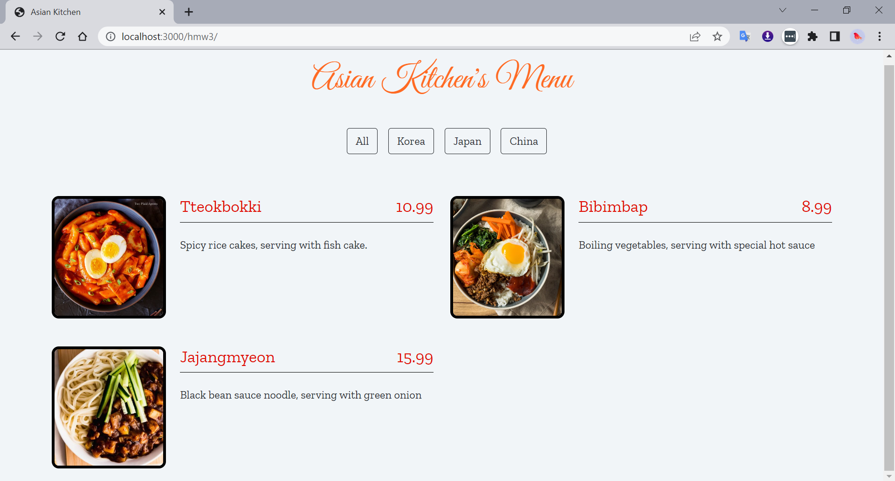

<!-- ABOUT THE PROJECT -->
## About The Asian Kitchen's Menu

In this homework, a menu for a kitchen is implemented. OOP is used to represent a menu and filter buttons are used for filtering the menu items. 

## Source Files
Source files for the homework: https://drive.google.com/drive/folders/1AWmcQkDTfz6VFXrzWCWi0QAqUs4IivMp

## Screenshot

